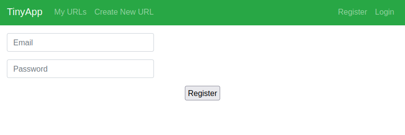
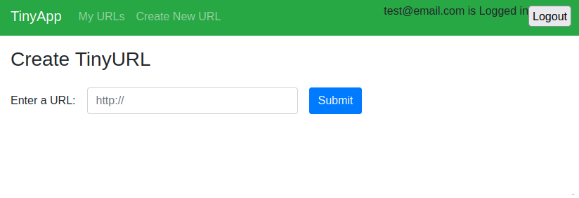
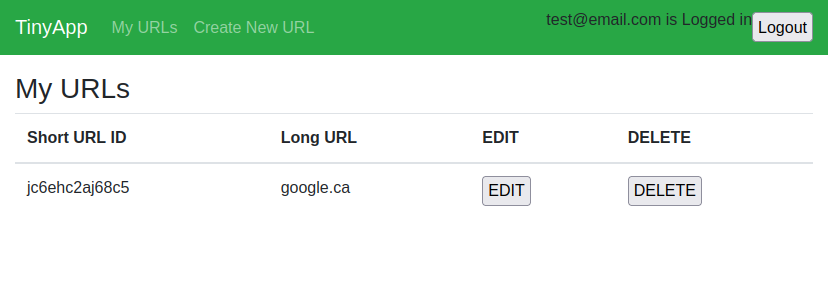
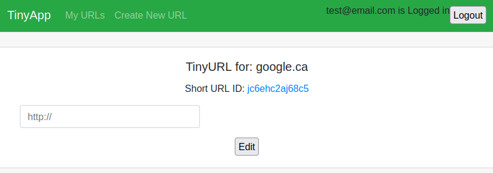
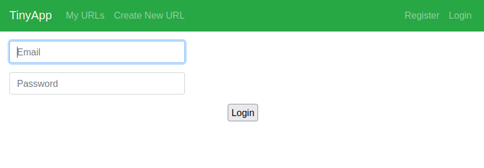

# TinyApp 

A tiny URL shortener application writen with nodejs/express.

- register/login as a unique user 
- create tinyURLs as that user

Note: this application is not for production environments. 

## Demo Screens

## Getting Started and running 

In the tinyApp directory:

`npm install `
`npm run `

in your browser goto:

`https://localhost:8080/register/`

in most cases the application will goto

`https://localhost:8080/urls/`

## Testing and Troubleshooting 

**Utility function tests**

To test the utility function run:

npm test

**Port binding**
Sometimes nodejs binds to port 8080 and does 
not release it when it crashes during testing.
Here is how to release it:

on unix:

lsof -i :8080
kill -9 <PID>

**Cookie clearing**

ensure session cookies are cleared in 
your browser.

In firefox
ctrl+shift+I > storage > leftbar: "cookies"

In Chrome
ctrl+shift+I > Application > leftbar: "cookies"

## Dependencies

- express js
- Tested on node 18LTS & Node v16.13.2
- [EJS template engine](https://ejs.co/)
- [cookie-session](https://www.npmjs.com/package/cookie-session)
- [bcryptjs](https://www.npmjs.com/package/bcryptjs)
- (dev) [mocha](https://mochajs.org/)
- (dev) [chai js](https://www.chaijs.com/)
- (dev) [nodemon](https://github.com/remy/nodemon)
- (dev) [morgan](https://github.com/expressjs/morgan)
